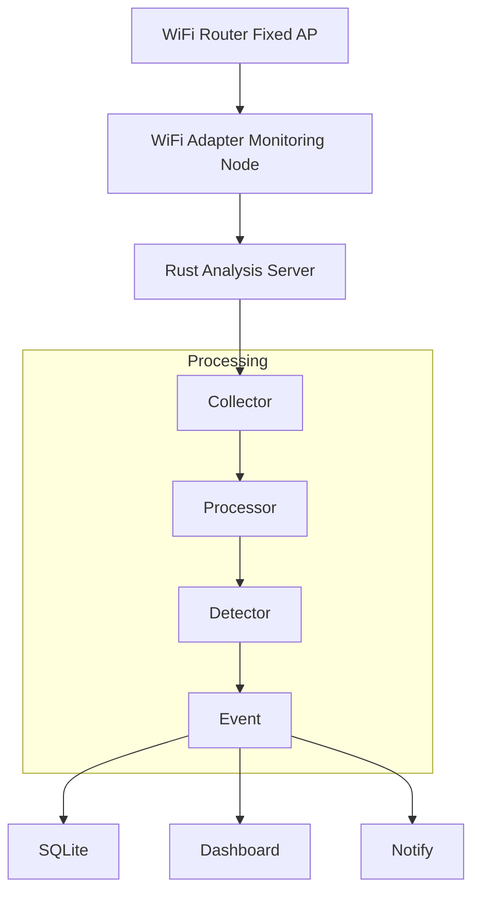
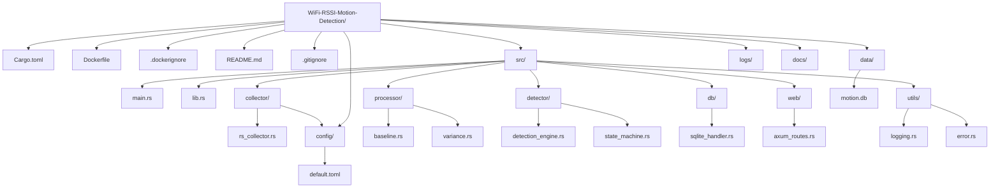

# WiFi RSSI Motion Detection (Single Node Experiment)

## Overview

This project investigates whether **human movement** can be reliably detected using **WiFi Received Signal Strength Indicator (RSSI)** fluctuations observed from a **single measurement point**.

The objective is not precise indoor positioning, but rather a lightweight, **privacy-friendly motion detection system** that requires no cameras, microphones, or specialized sensors.

By analyzing only RSSI variations between a standard WiFi router and a monitoring device, the system aims to determine:

- Whether someone is moving within the monitored area  
- Whether movement is weak or strong  
- Whether the area is currently active or quiet  

This approach is ideal for simple **home activity monitoring** or **anomaly detection** in environments where camera-based solutions are undesirable.

## Goals

**Primary Objective**  
Test whether a single WiFi signal source can detect human presence and movement through natural signal disturbances.

**Expected Capabilities**
- Detect movement within a room  
- Distinguish between quiet and active environments  
- Identify sudden activity during unusual hours  

**Out of Scope for This Experiment**
- Counting the number of people  
- Determining exact positions  
- Tracking movement paths  
- Recognizing specific actions or gestures  

This single-node experiment serves as a minimal, low-cost proof-of-concept before advancing to multi-node or Channel State Information (CSI) systems.

## System Architecture

The architecture is intentionally minimal:

**Router**  
↓  
**Monitoring Node** (collects RSSI continuously)  
↓  
**RSSI Data Collector**  
↓  
**Movement Detection Engine** (analyzes fluctuations)  
↓  
**Event Logger / Alert System**

The monitoring node runs a lightweight algorithm that evaluates RSSI patterns in real time.



## Project Folder Architecture



This structure follows Rust best practices:
- Clear separation of concerns (`collector`, `processor`, `detector`)
- Easy to extend (add `multi_node/` or `ml/` folders later)
- Ready for Docker and production deployment

## Hardware Requirements

**Router**  
Any standard WiFi router (tested example: Buffalo WSR-3600BE4P or equivalent).

**Monitoring Node**  
Any of the following:  
- Mini PC  
- Raspberry Pi  
- NAS with Docker support  
- Laptop  

**WiFi Adapter**  
The monitoring node must use a WiFi interface capable of reporting raw RSSI values (most Linux-compatible adapters support this).

## Software Stack

**Recommended**  
- **Operating System**: Linux (Ubuntu, Debian, or Alpine)  
- **Programming Language**: Rust (for performance and reliability)  

**Optional Components**  
- SQLite database for persistent storage  
- Docker for easy deployment  
- Simple web-based dashboard for real-time RSSI visualization  

## Detection Principle

Human bodies influence radio waves in three primary ways:

- **Absorption**: Body tissue absorbs 2.4/5 GHz energy  
- **Blocking**: A person between router and monitor attenuates the signal  
- **Multipath disturbance**: Movement alters reflection paths off walls and objects  

These effects create short-term fluctuations in RSSI.  
The system does **not** rely on absolute signal strength. Instead, it monitors:

- RSSI variance  
- Deviation from a moving average  
- Short-term signal instability  

Movement is flagged when these metrics exceed calibrated thresholds.

## Detection Algorithm

The core engine uses a **sliding window** of recent RSSI samples (recommended: 10–20 samples).

**Metrics computed per window**:
- Mean RSSI  
- Standard deviation  
- Absolute deviation from established baseline  

**Detection Logic**:
1. Continuously collect RSSI samples  
2. Maintain a dynamic baseline from quiet periods  
3. Calculate variance within the current window  
4. Trigger a motion event when variance exceeds threshold across multiple consecutive windows  

**Activity Levels**:
- Level 0: Quiet environment  
- Level 1: Minor disturbance  
- Level 2: Human movement detected  
- Level 3: Continuous activity  

A cooldown mechanism prevents false repeated triggers.

## Data Collection

**Sampling Rate**: 5–20 Hz (configurable)

**Each record contains**:
- Timestamp (Unix epoch)  
- Device identifier  
- RSSI value (dBm)

**Example**:
```json
{
  "timestamp": 1740001234,
  "device": "monitor-node-01",
  "rssi": -61
}
```

Data is held in memory for real-time analysis and optionally persisted to SQLite.

## Experiment Procedure

1. **Baseline Measurement**  
   Record RSSI for 10 minutes with no human movement to establish the environmental noise profile.

2. **Movement Test**  
   Walk through the monitored area at normal speed multiple times while recording data.

3. **Continuous Activity Test**  
   Move continuously inside the room for several minutes to observe sustained variance patterns.

4. **Threshold Tuning**  
   Adjust detection thresholds based on collected data to minimize false positives while maintaining sensitivity.

## Recommended Test Environment

For reproducible results:
- Router position must remain fixed  
- Furniture and doors/windows should stay unchanged during tests  
- Avoid heavy WiFi traffic or other wireless devices during initial experiments  
- Start with a single room or corridor  
- Ideal distance: 3–6 meters between router and monitoring node  

## Expected Performance

| Capability                  | Reliability (Single Node) | Notes |
|-----------------------------|---------------------------|-------|
| Movement detection          | High                      | Reliable for walking motion |
| Activity intensity          | Moderate                  | Can distinguish weak vs strong movement |
| Room-level presence         | Moderate                  | Coarse occupancy sensing |
| Human counting              | Not feasible              | — |
| Precise localization        | Not feasible              | Requires multi-node setup |

Higher accuracy generally requires multiple receivers or CSI data.

## Limitations

- RSSI is inherently noisy and environment-dependent  
- Furniture rearrangement or new objects can alter baseline behavior  
- Interference from other wireless devices may increase false positives  
- Static (non-moving) people are difficult to detect  
- Multiple simultaneous movers may register as a single event  

## Future Improvements

- Multi-node sensing for spatial inference  
- Channel State Information (CSI) using compatible WiFi cards  
- Environment-specific signal fingerprinting  
- Machine-learning classification models  
- Integration with smart-home and security systems (e.g., nighttime anomaly alerts)  

## Possible Applications

- Privacy-friendly home motion detection  
- Nighttime security alerts  
- Smart-home automation triggers  
- Occupancy estimation  
- WiFi-based presence sensing (no cameras)  

## License

MIT License
